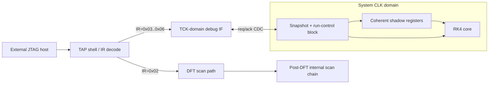
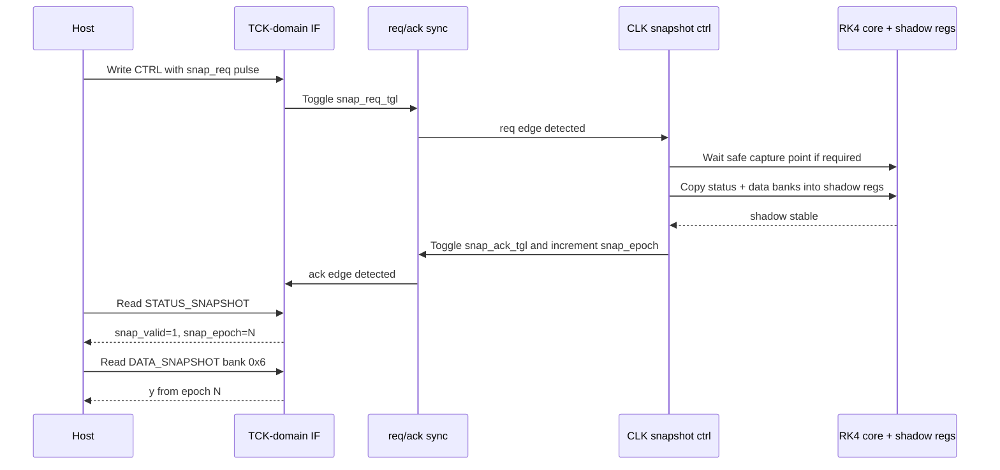
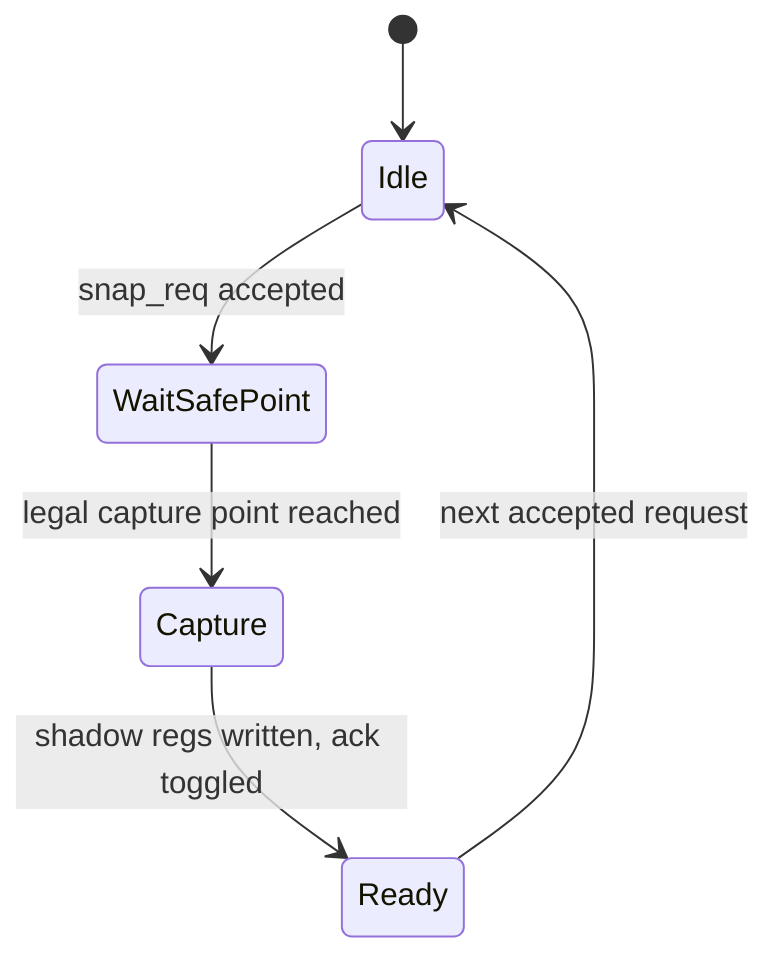
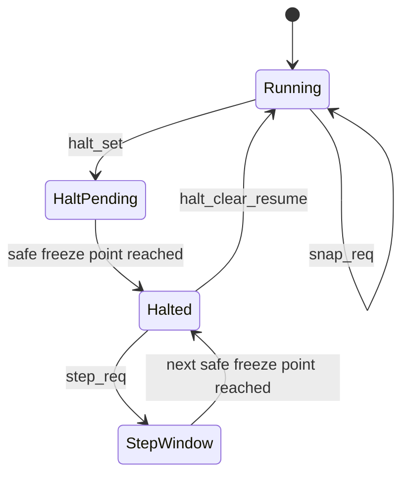
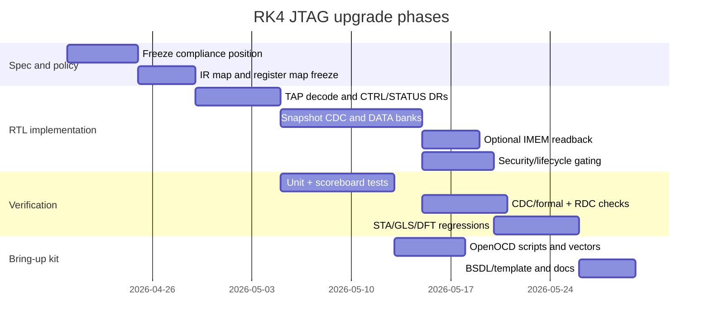

# RK4 ASIC JTAG Improvement Plan

## Executive summary

The current RK4 project already has a **good TAP shell**: a 5-bit instruction register, IDCODE selected after reset, BYPASS support, dual reset paths through `TRST` and the standard TMS-high sequence, TCK-local control logic, negedge-updated TDO, and DFT scripts that keep TCK-domain TAP flops out of the main scan chain. Those are real strengths and should be preserved. But the TAP is currently **not a useful functional debug interface** for the RK4 engine, because the only nontrivial internal access path, `SCAN_ACCESS`, is stubbed to a constant zero in RTL and is only intended to be replaced later by DFT scan stitching. In practical terms, today’s implementation can identify the chip and shorten a chain, but it cannot answer the bring-up questions that matter most: “Is the RK4 FSM alive?”, “What are `t` and `y` right now?”, “Did the f-engine image load correctly?”, or “Can I halt and inspect state without depending on UART?” fileciteturn0file0

A second, stricter conclusion is also warranted. The current design looks like a solid **custom JTAG TAP**, but not yet like a fully documented **IEEE 1149.1 boundary-scan device**. IEEE 1149.1 covers both the TAP architecture and standardized structural/procedural descriptions, and common boundary-scan tool guidance assumes mandatory instructions such as BYPASS, SAMPLE/PRELOAD, and EXTEST when a device claims boundary-scan compliance. The uploaded project material documents BYPASS and IDCODE behavior, but does not document a boundary-scan register, EXTEST, SAMPLE/PRELOAD, or a validated BSDL file. That means the safest present characterization is: **good TAP-state-machine implementation, incomplete boundary-scan compliance story, and missing functional debug architecture**. citeturn3view5turn3view8turn7view0turn19view1 fileciteturn0file0

The best-fit upgrade for this RK4 ASIC is therefore **not** a generic, CPU-scale debug subsystem and **not** direct reuse of the ATPG scan chain as the day-to-day debug interface. The best fit is a **snapshot-oriented functional debug block behind the existing TAP**: keep the TAP shell, keep SCAN_ACCESS for DFT only, and add a small set of custom data registers for coherent status, banked state readout, limited run control, and optional instruction-memory readback. That architecture matches the shape of the RK4 engine: a compact accelerator with a finite set of high-value internal states, not a processor that needs a broad addressable debug fabric. It also aligns with established practice of keeping JTAG logic in the TCK domain and crossing into the system domain deliberately rather than by ad hoc signal snooping. citeturn5view2turn6view0turn12view0turn12view1

The central design change recommended here is to replace the project’s current “live direct read / asynchronous sample” instinct with a stricter **coherent snapshot protocol**. Single-bit control crossings should use conventional multi-flop synchronizers, while multi-bit debug data should move only under a request/acknowledge protocol that guarantees the data bus is stable when it is sampled. That is the lowest-risk way to get FPGA bring-up value, post-silicon observability, manufacturing coexistence with scan, and bounded verification cost. Formal and static CDC signoff should then cover structural crossings, handshake behavior, reconvergence, metastability modeling, and reset-domain crossings. citeturn12view0turn12view1turn13view0

The practical bottom line is this: **preserve the present TAP, separate DFT from functional debug, add four custom debug instructions, define a safe halt contract, gate intrusive access by lifecycle/fuse policy, and validate the whole path with OpenOCD-style scripts, CDC checks, BSDL work products, and scan-path/ATE vectors.** That is the smallest architecture that materially improves the RK4 project without turning JTAG into its own project. citeturn4view0turn4view1turn14view0turn19view1

## Current implementation inventory

The table below consolidates the current implementation state from the uploaded project analysis and flags what is genuinely known versus what remains unspecified. fileciteturn0file0 fileciteturn0file1

| Item | Current state | Assessment for upgrade plan |
|---|---|---|
| TAP controller | Full 16-state TAP FSM with combinational control decoding and async TRST reset | **Preserve as-is** unless RTL bug is found |
| IR length | 5 bits | Good baseline; also matches the minimum IR width expected by the JTAG DTM model in the debug spec world citeturn6view0 |
| IDCODE | `0x10682001`; reset defaults to IDCODE | Good for lab discovery, but the documented manufacturer field is effectively placeholder-like and should not be treated as production-grade until a valid JEDEC/JEP106 assignment strategy is defined. fileciteturn0file0 citeturn6view0 |
| IR opcodes | `0x00` BYPASS alias, `0x01` IDCODE, `0x02` SCAN_ACCESS, `0x1F` BYPASS canonical, others default to BYPASS | Good for a custom TAP; **not sufficient evidence of full boundary-scan compliance** because EXTEST/SAMPLE/PRELOAD are not documented. fileciteturn0file0 citeturn3view8turn7view0 |
| DR inventory | IDCODE, BYPASS, external SCAN_ACCESS only | Functional debug is effectively absent in current RTL. fileciteturn0file0 |
| SCAN_ACCESS behavior | `scan_enable_o` and `scan_in_o` driven; `scan_out_i` hardwired to `1'b0` in RTL; intended for post-DFT chain stitching | Keep for ATPG/DFT; **do not** treat as the project’s primary debug interface. fileciteturn0file0 |
| Reset behavior | Async active-low `TRST` plus standard five-TMS reset path; IR resets to IDCODE | Good and should be retained. fileciteturn0file0 |
| TDO timing | TDO and TDO output-enable updated on TCK falling edge; OE asserted only in shift states | Correct and should be retained. fileciteturn0file0 |
| DFT scan integration | Muxed scan; JTAG/TCK flops marked `dft_dont_scan`; single chain `scan_in` to `scan_out` | Good baseline for coexistence with ATPG. fileciteturn0file0 |
| Boundary-scan register | Unspecified in project material | Treat as **unspecified / likely absent at present** |
| SAMPLE/PRELOAD, EXTEST | Unspecified in project material | If not implemented, the device should **not** be presented as a full 1149.1 boundary-scan device. citeturn3view8turn7view0 |
| BSDL status | Unspecified in project material | Must be treated as **missing until generated and validated** if boundary-scan compliance is claimed. citeturn7view0turn19view1 |
| OpenOCD profile | Unspecified | Generic JTAG use is straightforward; stock RISC-V DTM tooling is **not** appropriate unless `dtmcs`/`dmi` semantics are actually implemented. citeturn6view0turn4view0 |
| Security / lifecycle gating | Unspecified | Must be added or at least stubbed architecturally before tapeout if fielded silicon is a possibility. citeturn5view0turn5view2 |
| System clock frequency | Unspecified | Assumptions in this report use an async relation between `clk` and `tck` |
| Area budget | Unspecified | Area estimates below are rough planning numbers only |
| Package / pad-ring boundary cells | Unspecified | Critical for any future “full 1149.1 boundary-scan” claim |
| Board-level chain order / termination | Unspecified | Must be documented before OpenOCD or ATE deployment. citeturn8view3turn19view2 |

The most important preservation items are the existing TCK-local TAP shell, the negedge TDO timing, the dual reset behavior, and the DFT separation between the TAP flops and the main scan chain. The most important missing items are a functional debug transport, coherent CDC handling, a documented compliance position, a BSDL plan, and any lifecycle/security gating policy. fileciteturn0file0 citeturn7view0turn13view0

## Goals and success criteria

The JTAG upgrade should be judged against the project’s actual needs, not against an abstract desire to “add more JTAG.” For RK4, the upgrade succeeds only if it improves debug **without** destabilizing DFT or exploding verification scope.

| Goal | Success criterion | Why it matters |
|---|---|---|
| FPGA bring-up usability | From reset, with UART unavailable, a lab script can read IDCODE, read a coherent status snapshot, request halt, capture one snapshot epoch, and dump all primary numerical state banks plus optional IMEM words | Removes UART as a single point of failure |
| Post-silicon debug value | A non-responsive device can still be classified as reset, alive, busy, halted, or faulted; `t`, `y`, RK4 slope registers, FSM state, step counter, and f-engine PC/state are observable | Makes first-silicon diagnosis tractable |
| Manufacturing DFT compatibility | Existing SCAN_ACCESS/scan-chain flow remains intact; new functional debug logic does not break ATPG or chain verification; scan-path verify still passes on BYPASS, IDCODE, IR capture, and TAP operation | Keeps structural test coverage and tool flows viable |
| Security / lifecycle control | In locked production state, custom functional-debug instructions alias BYPASS or return benign zeroized data; intrusive access requires explicit enable policy | Prevents debug from becoming an ungoverned backdoor |
| Minimal CDC risk | No user-visible wide word is taken from a freely running live multi-bit bus; only single-bit control lines cross with 2-FF synchronizers; all wide data are either shadowed or held stable under handshake | Avoids metastability and incoherent reads |
| Verification cost discipline | Baseline implementation uses at most four new debug instructions plus one optional IMEM instruction; no arbitrary write-anything bus in rev A; no claim of full boundary scan until the pad-ring work exists | Keeps the feature set signoff-able |
| Tool interoperability | Generic JTAG tools can discover the TAP with `irlen`, `expected-id`, and IRCAPTURE checking; host access can be scripted with raw IR/DR scans without custom adapter firmware | Makes the interface immediately usable in the lab |

A useful additional success metric for this project is **snapshot economy**: a complete coherent state dump of the RK4 datapath should require **one snapshot request plus eleven data-bank reads** in the baseline design, not a large number of live point reads while the datapath moves underfoot. That keeps the interface small but still decisive for debugging.

## Standards and tool expectations

The external anchor set for this plan is the 1149.1 work of entity["organization","IEEE","standards body"], the debug-transport model published by entity["organization","RISC-V International","standards organization"], implementation guidance visible in entity["organization","OpenTitan","open source silicon"], chain/tool assumptions in entity["organization","OpenOCD","debug tool project"], and board-test/DFT guidance from entity["company","XJTAG","boundary scan tools"]. The important analytical point is that these references describe **different layers** of expectation: TAP behavior, debug-transport conventions, chain/tool discovery, and full boundary-scan compliance are related, but they are not the same thing. citeturn3view5turn6view0turn5view2turn4view0turn19view1

IEEE 1149.1 defines test logic plus structural/procedural description languages for testing interconnects, testing the IC itself, and observing or modifying internal data during test, programming, configuration, or debug. But if a device is presented as a full boundary-scan device, common tool literature assumes standard boundary-scan concepts such as BYPASS, SAMPLE/PRELOAD, EXTEST, a boundary-scan register, and a BSDL description. In the TI primer, BYPASS is defined as all ones and EXTEST as all zeroes; IDCODE is optional but, if implemented, should be immediately available after reset. That is why the current RT L-level correctness of the TAP state machine is not enough, by itself, to claim full boundary-scan compliance. citeturn3view5turn3view8turn7view0

The custom-debug layer has a different standard anchor. The debug spec’s JTAG DTM model says a JTAG debug transport must use an IR of at least 5 bits, default the IR to `00001` after reset so IDCODE is selected, and send unimplemented instructions to BYPASS. It also defines canonical debug registers such as `dtmcs` at `0x10` and `dmi` at `0x11`. The RK4 ASIC should **not** advertise itself as implementing that DTM unless those semantics are actually implemented. For this project, generic raw JTAG scans are the right tool contract; pretending to be a RISC-V DTM when the underlying interface is not one would make tooling less reliable, not more. citeturn6view0

OpenOCD-style tooling expects explicit TAP declaration with `-irlen`, strongly prefers an `-expected-id`, and by default verifies the IRCAPTURE low-bit pattern using `-ircapture` / `-irmask`. It also supports direct `irscan` and `drscan` usage, and it recommends benign end states such as `run/idle`, `drpause`, or `irpause` after scans because other end states can create side effects. For the current RK4 TAP shape, that means the interface can be made immediately scriptable with a simple custom config, provided the chain order, IR length, IDCODE, and basic capture behavior are documented correctly. citeturn4view0turn4view1turn4view2turn4view3turn17search0

Manufacturing and board-level expectations add still another layer. BSDL availability and validation are central to external boundary-scan tooling; chain design guidance assumes TCK, TMS, and optional nTRST are wired in parallel while TDI/TDO are daisy-chained; nTRST should not be tied permanently low; and scan-path verification commonly checks BYPASS, IDCODE, instruction-register behavior, boundary-scan registers, and TAP operation before deeper tests run. That means the RK4 project should adopt one of two honest positions and say so explicitly in its collateral: either **custom TAP plus scan/test transport** for this tapeout, or **full boundary-scan device** only after boundary cells, mandatory instructions, and a validated BSDL really exist. citeturn8view3turn19view1turn14view0turn19view2

The sharpest standards conclusion, therefore, is this:

| Layer | What the RK4 project should satisfy now | What should remain clearly out of scope unless extra work is funded |
|---|---|---|
| TAP shell / raw JTAG | Correct reset behavior, BYPASS, IDCODE, IRCAPTURE low bits `01`, documented IR length and chain behavior | Nothing; this is baseline |
| Generic lab tooling | OpenOCD-compatible `jtag newtap`, `expected-id`, `ircapture`, raw `irscan` / `drscan` scripts | Pretending to be a stock CPU/debug target |
| Functional debug | Coherent custom DRs behind the TAP | Ad hoc live multi-bit snooping |
| Boundary-scan compliance claim | Only if BSR, EXTEST, SAMPLE/PRELOAD, pad-cell work, and BSDL are actually delivered | Claiming “IEEE 1149.1 compliant” based only on the TAP FSM |

## Recommended architecture

The best fit for RK4 is a **snapshot-oriented hybrid**: preserve the existing TAP shell, preserve `SCAN_ACCESS` for ATPG/DFT only, and add a compact functional-debug block with coherent snapshots and limited run control. This is stricter and safer than the uploaded document’s “async status plus direct live register bridge” instinct, because it removes the most fragile CDC pattern: exposing multi-bit live system-domain state directly to the TCK domain. The recommendation also avoids the opposite mistake of building a full address-mapped CPU-style debug fabric whose complexity would outweigh its value for a small numerical engine. fileciteturn0file1 citeturn5view2turn12view0turn12view1

### Candidate DR-set comparison

| Candidate | Bring-up value | CDC risk | Verification cost | DFT coexistence | Security surface | Verdict |
|---|---:|---:|---:|---:|---:|---|
| Status-only capture | Moderate | Medium if async multi-bit capture is used | Low | Excellent | Low | Better than today, but not enough |
| Direct live register read bridge | High | Medium to high unless carefully halted | Moderate | Good | Moderate | Better, but still too live-data-centric |
| **Snapshot-oriented hybrid** | **High** | **Low to moderate** | **Moderate** | **Excellent** | **Moderate** | **Recommended** |
| Full DMI-like debug module | Very high | Moderate | High | Good | High | Overkill for RK4 rev A |

### Architectural split



This split keeps the ATPG chain and the functional debug path from fighting each other. It also mirrors the useful part of the debug-transport pattern in the debug spec and the implementation style documented by OpenTitan: JTAG logic remains on TCK, and the boundary to the system domain is explicit. citeturn6view0turn5view2

### Exact IR map

The proposed baseline 5-bit IR map is:

| IR code | Hex | Name | Purpose |
|---|---:|---|---|
| `00000` | `0x00` | BYPASS_LEGACY | Backward-compatible BYPASS alias; keep only for compatibility |
| `00001` | `0x01` | IDCODE | Existing IDCODE path |
| `00010` | `0x02` | SCAN_ACCESS | Existing DFT scan path |
| `00011` | `0x03` | STATUS_SNAPSHOT | New coherent status snapshot |
| `00100` | `0x04` | DATA_SNAPSHOT | New banked coherent data read |
| `00101` | `0x05` | CTRL | New halt/resume/step/snapshot control |
| `00110` | `0x06` | IMEM_READ | Optional instruction-memory readback |
| `11111` | `0x1F` | BYPASS | Canonical all-ones BYPASS |

All other opcodes should continue to decode to BYPASS. That is consistent with common debugger expectations for unimplemented instructions and preserves existing lab scripts. If full boundary-scan compliance is ever pursued later, the opcode story must be revisited because `0x00` is the canonical EXTEST code in boundary-scan literature, whereas the current project uses `0x00` as a BYPASS alias. citeturn6view0turn3view8

### STATUS_SNAPSHOT register

**Recommended width:** 64 bits

**Purpose:** Low-latency, coherent read of control/health/debug state captured in one snapshot epoch.

**Semantics:**  
`STATUS_SNAPSHOT` is **not** a live async sample. It is a read-only view of the most recent coherent snapshot stored in CLK-domain shadow registers and then exposed to TCK under stable-bus semantics.

| Bits | Field | Width | Meaning |
|---|---|---:|---|
| `[63]` | `snap_valid` | 1 | At least one coherent snapshot has completed since reset |
| `[62]` | `snap_busy` | 1 | Snapshot engine is currently servicing a request |
| `[61]` | `halted` | 1 | Core is at a safe halted point |
| `[60]` | `halt_pending` | 1 | Halt requested but not yet at a safe freeze point |
| `[59]` | `debug_visible_en` | 1 | Non-intrusive debug visibility enabled by policy |
| `[58]` | `debug_intrusive_en` | 1 | Intrusive control/readout enabled by policy |
| `[57]` | `error_sticky` | 1 | Sticky debug-error condition latched |
| `[56]` | `fsm_busy` | 1 | RK4 control FSM running |
| `[55]` | `y_neg` | 1 | Sign bit of `y` latched in snapshot |
| `[54]` | `f_active` | 1 | f-engine active in snapshot |
| `[53]` | `tx_ready` | 1 | UART TX ready in snapshot |
| `[52]` | `reserved` | 1 | Reads 0 |
| `[51:46]` | `ctrl_state` | 6 | RK4 top-level FSM state |
| `[45:39]` | `step_cnt` | 7 | RK4 iteration counter |
| `[38:35]` | `fe_pc` | 4 | f-engine PC |
| `[34:33]` | `fe_state` | 2 | f-engine internal state |
| `[32:31]` | `proto_state` | 2 | UART protocol parser state |
| `[30:25]` | `snap_epoch` | 6 | Snapshot epoch counter, increments on each completed snapshot |
| `[24:0]` | `reserved` | 25 | Reserved for future debug flags |

This register deliberately leaves room for future expansion without changing width. The most important practical rule is that **`STATUS_SNAPSHOT` and `DATA_SNAPSHOT` must refer to the same `snap_epoch`**. That is what gives the interface coherence.

### DATA_SNAPSHOT register

**Recommended width:** 40 bits

**Purpose:** Banked readout of the most recent coherent numerical snapshot.

**Update-DR request format:**  
Host shifts in a bank ID in bits `[37:34]`; all other bits are don’t-care.

**Capture-DR response format:**

| Bits | Field | Width | Meaning |
|---|---|---:|---|
| `[39]` | `valid` | 1 | Bank data valid |
| `[38]` | `bank_implemented` | 1 | Selected bank is implemented |
| `[37:34]` | `bank_id_echo` | 4 | Echo of selected bank ID |
| `[33:32]` | `reserved` | 2 | Reads 0 |
| `[31:0]` | `data` | 32 | Coherent shadow-word value |

**Recommended bank map:**

| Bank ID | Meaning |
|---:|---|
| `0x0` | `v0` |
| `0x1` | `t` |
| `0x2` | `k1` |
| `0x3` | `k2` |
| `0x4` | `k3` |
| `0x5` | `k4` |
| `0x6` | `y` |
| `0x7` | `acc` |
| `0x8` | `dt_reg` |
| `0x9` | `dt_half_reg` |
| `0xA` | `alu_result` |
| `0xB` | Reserved for future UART/debug data word |
| `0xC`–`0xF` | Reserved |

This banking choice is intentional. It captures exactly the quantities most useful for RK4 bring-up and numerical debugging while avoiding a broad address debug bus. It also keeps the baseline dedicated shadow storage to **eleven 32-bit words**, which is a manageable trade-off.

### CTRL register

**Recommended width:** 16 bits

**Purpose:** Minimal intrusive control plus status readback.

| Bits | Field | Access | Meaning |
|---|---|---|---|
| `[15]` | `halt_set` | W1S | Set sticky halt request |
| `[14]` | `halt_clear_resume` | W1C | Clear halt request and resume |
| `[13]` | `step_req` | W1P | Execute one safe-point step when already halted |
| `[12]` | `snap_req` | W1P | Request a new coherent snapshot |
| `[11]` | `core_soft_reset` | W1P | Reset RK4 core/debug shadow state but not TAP |
| `[10]` | `clr_error` | W1P | Clear `error_sticky` |
| `[9:8]` | `reserved` | — | Reads 0 |
| `[7]` | `halted_ro` | RO | Halted status |
| `[6]` | `halt_pending_ro` | RO | Halt pending status |
| `[5]` | `snap_busy_ro` | RO | Snapshot busy status |
| `[4]` | `snap_valid_ro` | RO | Snapshot valid status |
| `[3]` | `intrusive_en_ro` | RO | Intrusive debug policy enable |
| `[2]` | `visible_en_ro` | RO | Non-intrusive debug policy enable |
| `[1]` | `scan_dft_en_ro` | RO | DFT scan policy enable |
| `[0]` | `error_sticky_ro` | RO | Sticky debug error |

The baseline design should **not** include arbitrary register or memory writes in this register. That is a conscious verification and security decision.

### IMEM_READ register

**Recommended width:** 24 bits

**Purpose:** Optional low-cost readback of the 16-word microcoded f-engine program memory.

**Update-DR request format:** host supplies desired address in `[19:16]`.

**Capture-DR response format:**

| Bits | Field | Width | Meaning |
|---|---|---:|---|
| `[23]` | `valid` | 1 | Read valid |
| `[22]` | `addr_implemented` | 1 | Address supported |
| `[21:20]` | `reserved` | 2 | Reads 0 |
| `[19:16]` | `addr_echo` | 4 | Echo of requested IMEM address |
| `[15:0]` | `imem_data` | 16 | Instruction word |

Baseline policy should allow IMEM reads only when the core is idle or safely halted. If the first tapeout needs to save effort, this instruction can legally alias BYPASS; the opcode should still be reserved now so scripts and documentation do not churn later.

### Rough area / logic planning estimate

These are **planning estimates**, not synthesis results. The area budget is unspecified in the project material.

| Block | Rough added state | Rough added logic | Note |
|---|---:|---:|---|
| STATUS shadow | 64 FF | Low | CLK domain |
| DATA shadow | 352 FF | Low-to-moderate | Eleven 32-bit words |
| CTRL / request / response regs | ~40–80 FF | Moderate | Split across TCK and CLK domains |
| CDC synchronizers / toggles | ~8–16 FF | Low | Request/ack + status crossing |
| Bank muxes / decode | 0 FF | Moderate | Mostly combinational |
| Halt/run-control glue | Small | Moderate | In RK4 control path |
| Optional IMEM_READ path | ~16–32 FF | Low | No full IMEM shadow in baseline |

A reasonable early planning range is **roughly 500–600 additional flip-flops** plus **a few thousand gate equivalents** of control/mux logic. Exact numbers are unknown until synthesis on the target 180 nm library.

## CDC and run-control contract

Single-bit CDC and multi-bit CDC have to be treated differently. A classic two-flop synchronizer is appropriate for a single asynchronous control bit because the first stage may go metastable and the second stage filters that uncertainty before broader logic consumes it. Multi-bit values are different: they should not be “synchronized bit by bit” when coherence matters. Instead, the recommended pattern is a handshake synchronizer in which only the control signals cross through synchronizers, while the associated data bus is held stable long enough for the receiving side to latch it safely. Modern CDC signoff should then check structure, functional protocol, reconvergence, metastability effects, and reset-domain behavior. citeturn12view1turn12view0turn13view0

### Crossing inventory

| Crossing | Direction | Signal type | Recommended method |
|---|---|---|---|
| `snap_req_tgl` | TCK → CLK | Single-bit event | 2-FF synchronizer + edge detect |
| `snap_ack_tgl` | CLK → TCK | Single-bit event | 2-FF synchronizer + edge detect |
| `halt_req_level` | TCK → CLK | Single-bit level | 2-FF synchronizer |
| `halted_status` | CLK → TCK | Single-bit status | 2-FF synchronizer or inclusion in status shadow |
| `bank_sel` | TCK → CLK | Small command field | Latch with request; sample only under active request protocol |
| `shadow_word[31:0]` | CLK → TCK | Multi-bit data | Stable-bus capture only after acknowledge |
| `imem_word[15:0]` | CLK → TCK | Multi-bit data | Stable-bus capture only after acknowledge |
| policy / lifecycle enables | top-level async → TCK/CLK | Single-bit or encoded level | Sample/latch at reset, then synchronize locally |

### Snapshot protocol

The most important semantics are:

- `snap_req` does **not** expose live state.
- The snapshot controller waits until it is legal to capture.
- One requested snapshot yields one coherent `snap_epoch`.
- `STATUS_SNAPSHOT` and all `DATA_SNAPSHOT` banks for that epoch are coherent with each other.
- No new snapshot is accepted until the prior one is quiescent.



### Snapshot state machine



A “legal capture point” is simpler than a halt point. For a non-intrusive snapshot, it is sufficient that all fields being captured are sampled on one system-clock edge into the shadow registers. For intrusive debug flows, a halt may be requested first so that the snapshot reflects a stable computational state that will not advance while the host reads multiple banks.

### Stable-bus rule

The CLK-domain shadow bank mux must obey one strict contract:

- once `snap_ack_tgl` is launched, the selected stable shadow outputs must not change until the next accepted snapshot request or the next bank-read command completion;
- the TCK domain must only sample a wide data bus after the corresponding acknowledge has been observed and the associated bank selection is stable.

That contract is what allows safe multi-bit sampling without per-bit synchronizers.

### Halt, resume, and single-step semantics

The halt path needs a precise microarchitectural contract or it will become a source of deadlocks and ghost bugs. The recommended contract is:

| Command | Meaning | Accepted when | Completion rule |
|---|---|---|---|
| `halt_set` | Request halt | Any time debug policy permits intrusive control | Core stops only at a **safe freeze point** |
| `halt_clear_resume` | Resume continuous execution | When halted or halt pending | Clears halt request and returns to normal dispatch |
| `step_req` | Execute **one safe-point step** | Only when already halted | Core advances from one safe point to the next safe point, then halts again |
| `core_soft_reset` | Reset RK4 core only | When intrusive control permitted | Clears runtime state and invalidates snapshots |

The best definition of a **safe freeze point** for this project is:

1. no register-file write is currently being committed,  
2. no datapath side-effect for the current top-level RK4 state remains half-issued,  
3. the f-engine is not in the middle of a micro-sequence that would be left architecturally ambiguous if frozen, and  
4. the next top-level RK4 FSM state has not yet begun issuing new work.

That means step semantics are **state-granular**, not cycle-granular. If one top-level FSM transition internally requires an f-engine action that spans several system clocks, a single-step command should encompass that entire action and re-halt only at the next safe point. That is much more understandable in debug, and much safer in hardware.



### UART and memory interactions

The UART and protocol logic should **not** be frozen at arbitrary bit times. The safe policy is:

- allow any in-flight TX byte to complete its serial frame,
- keep RX/TX clocking alive so line protocol remains valid,
- but block acceptance of new `LOAD_PROG` or `RUN` transactions while `fsm_busy`, `halt_pending`, or `halted` is asserted.

When such a blocked command is observed, the debug block should set `error_sticky`. If IMEM readback is implemented, it should be permitted only when the RK4 engine is idle or halted. There is no need, in rev A, to support JTAG writes into IMEM or the register file.

### Failure modes and mitigations

| Failure mode | Root cause | Mitigation |
|---|---|---|
| `halt_pending` never clears | f-engine or control FSM never reaches safe point | Add timeout status and sticky error; use `core_soft_reset` as recovery |
| Snapshot returns incoherent data | wide bus sampled without stable-bus guarantee | Enforce request/ack protocol and hold data stable until capture completes |
| Step while running | host issues `step_req` outside halted state | Ignore request and set `error_sticky` |
| UART framing corruption during halt | bit-level TX/RX frozen mid-byte | Never freeze serial shifters mid-bit; only gate protocol acceptance |
| IMEM read during disallowed state | command issued while running and not halted | Return invalid response and set `error_sticky` |
| Security bypass through debug | custom IRs still active when locked | In locked policy state, remap custom IRs to BYPASS or zeroized responses |

## Security and lifecycle gating

A debug port that can halt execution and expose internal state needs an explicit policy, even on an academic ASIC. OpenTitan’s documentation is useful here not because the RK4 ASIC should copy its full security architecture, but because it demonstrates two principles that matter directly: debug functionality should be **lifecycle-gated**, and the effective debug-enable state should be **latched across core-only reset events** so a debug-initiated reset does not sever the debugger’s own control path mid-operation. citeturn5view0turn5view2

The minimal policy model for RK4 should distinguish **DFT scan enable**, **non-intrusive debug visibility**, and **intrusive debug control**. These should not be conflated into one bit.

| Mode | `IDCODE` / `BYPASS` | `SCAN_ACCESS` | `STATUS_SNAPSHOT` | `DATA_SNAPSHOT` / `CTRL` / `IMEM_READ` |
|---|---|---|---|---|
| Manufacturing / test-unlocked | Enabled | Enabled | Enabled | Enabled |
| Lab / development-unlocked | Enabled | Usually disabled unless needed | Enabled | Enabled |
| Production locked | Enabled | Disabled | Optional but preferably disabled or heavily redacted | Disabled |
| Invalid / unknown policy state | Enabled | Disabled | Disabled | Disabled |

A practical signal set, if the top-level SoC has no formal lifecycle controller, is:

- `dbg_visible_en_i` — sampled at reset; permits non-intrusive status visibility,
- `dbg_intrusive_en_i` — sampled at reset; permits halt/data/imem access,
- `dft_scan_en_i` — sampled at reset; permits SCAN_ACCESS,
- `otp_debug_disable_i` — one-way disable input if an OTP/fuse path exists.

If the project later grows into a larger secure SoC, those same logical enables can be driven by lifecycle/OTP infrastructure instead of straps.

### Recommended lock behavior

When intrusive debug is disabled:

- `CTRL`, `DATA_SNAPSHOT`, and `IMEM_READ` should decode to BYPASS-like behavior or return zeroized/invalid data,
- `STATUS_SNAPSHOT` should either be disabled as well or expose only a reduced, non-sensitive subset,
- `SCAN_ACCESS` should be disabled unless explicitly in DFT/manufacturing mode,
- `error_sticky` should not leak detailed reasons that help an attacker distinguish policy states more finely than necessary.

### Recommended reset behavior under debug policy

A core-only reset should:

- reset the RK4 engine,
- invalidate `snap_valid`,
- clear `halt_pending` / `halted`,
- preserve the **latched** debug policy enough that the external debugger can immediately re-establish control without needing a full chip reset.

That is the RK4 analogue of the “keep the JTAG side alive across non-debug-module reset” principle documented by OpenTitan. citeturn5view0turn5view2

### Secure unlock sequence

Because the project’s fuse/OTP/security fabric is currently unspecified, the recommended baseline is **strap/fuse gating only**. That is the lowest-risk and most honest rev-A choice.

If the project later needs a field unlock path, reserve **IR `0x07`** for an optional `UNLOCK_TOKEN` register rather than overloading existing DRs. A conservative future sequence would be:

1. power-on / core reset samples a `debug_request` strap,  
2. TAP remains visible but intrusive debug is still locked,  
3. host reads a nonce or lock-state indicator,  
4. host writes token words to `UNLOCK_TOKEN`,  
5. hardware compares a derived response against OTP-anchored material,  
6. `debug_intrusive_en` is lifted until the next reset.

That extension is **not part of the baseline recommendation** because it adds security complexity, state, and verification burden. It should only be added if the project truly has a field-deployment threat model.

## Verification, deliverables, and roadmap

The verification plan should treat the upgraded JTAG path as a first-class subsystem. Tool guidance is clear that good scan/debug deployment depends on correct chain description, validated BSDL content where applicable, and explicit scan-path verification of TAP and register behavior. CDC signoff should cover structure, function, reconvergence, metastability effects, and reset crossings. citeturn14view0turn19view1turn13view0

### Verification matrix

| Layer | What to verify | Method | Pass criterion |
|---|---|---|---|
| TAP shell | Full 16-state FSM, reset paths, TDO edge, OE behavior, IDCODE default, undefined-opcode→BYPASS | RTL unit tests + assertions | Matches current behavior exactly except for newly documented instructions |
| IRCAPTURE / tool visibility | Low IR capture bits `01`, correct IR length, correct expected IDCODE | OpenOCD raw chain scripts | `jtag newtap` succeeds; `verify_ircapture` stays clean |
| STATUS_SNAPSHOT | Epoch behavior, coherent fields, lock redaction | RTL tests + scoreboards | All fields belong to one snapshot epoch |
| DATA_SNAPSHOT | All bank IDs, invalid-bank response, stale/valid semantics | RTL tests + reference model | Eleven primary banks read back correctly |
| CTRL | Halt, resume, step, soft reset, error clear | Directed tests + assertions | No illegal state progression; step is safe-point granular |
| IMEM_READ | Address echo, valid gating, idle/halted restriction | Directed tests | Readback matches loaded program words |
| CDC | Req/ack protocol, stable-data assumption, no unsafe reconvergence | Static/formal CDC + assertions | No unwaived violations on approved crossing patterns |
| DFT coexistence | SCAN_ACCESS unchanged, synchronizers tagged correctly, ATPG unaffected | DFT flow regression | Existing scan chain still stitches and tests |
| Gate/timing | TCK constraints, CDC false paths, no TDO timing regression | STA + GLS as needed | Clean timing with approved exceptions |
| Silicon bring-up | Real host sequences on bench | OpenOCD/FTDI or equivalent | ID, halt, snapshot, read banks, resume all work on hardware |

### Recommended directed test vectors

| Vector ID | Sequence | Expected outcome |
|---|---|---|
| TV-RESET-ID | Apply TRST, shift DR immediately under IDCODE | Correct IDCODE appears |
| TV-IRCAP | Perform IR capture scan | LSBs read as `01` |
| TV-BYPASS | Select BYPASS and shift several bits | Single-bit serial latency observed |
| TV-STATUS-IDLE | Snapshot while idle | `fsm_busy=0`, state fields sane |
| TV-HALT-RUN | Start RK4 run, assert halt | `halt_pending` then `halted` |
| TV-STEP | Step three times from halted state | FSM advances three safe points, then remains halted |
| TV-DUMP | Halt, snapshot once, read all eleven data banks | Coherent `snap_epoch`; values match checker |
| TV-IMEM | Load program via UART, read all 16 IMEM words via JTAG | All words match loaded image |
| TV-LOCKED | Hold locked policy, try custom IRs | No intrusive access; BYPASS/invalid behavior only |
| TV-SCANACCESS | Post-DFT regression under scan enable | Scan chain still operates as expected |

### Example pseudo-RTL interface sketch

The sketch below is deliberately small and keeps the TCK boundary obvious.

```systemverilog
module rk4_jtag_dbg_bridge (
  // TCK domain
  input  logic        tck_i,
  input  logic        trst_ni,
  input  logic        capture_dr_i,
  input  logic        shift_dr_i,
  input  logic        update_dr_i,
  input  logic [4:0]  ir_q_i,
  input  logic        tdi_i,
  output logic        tdo_dbg_o,

  // System clock domain
  input  logic        clk_i,
  input  logic        rst_ni,

  // Policy / lifecycle
  input  logic        dbg_visible_en_i,
  input  logic        dbg_intrusive_en_i,
  input  logic        dft_scan_en_i,

  // RK4 observability
  input  logic [5:0]  ctrl_state_i,
  input  logic [6:0]  step_cnt_i,
  input  logic [3:0]  fe_pc_i,
  input  logic [1:0]  fe_state_i,
  input  logic [1:0]  proto_state_i,
  input  logic        fsm_busy_i,
  input  logic        f_active_i,
  input  logic        tx_ready_i,
  input  logic [31:0] v0_i, t_i, k1_i, k2_i, k3_i, k4_i, y_i, acc_i,
  input  logic [31:0] dt_i, dt_half_i, alu_result_i,
  input  logic [15:0] imem_word_i,
  output logic [3:0]  imem_addr_o,

  // Run control
  output logic        dbg_halt_req_o,
  output logic        dbg_core_soft_reset_o,
  input  logic        dbg_halted_i
);
  // TCK-side command regs
  // req/ack toggle synchronizers
  // CLK-side snapshot controller
  // coherent shadow regs
  // bank mux + TCK capture path
endmodule
```

This interface reflects the core design principle used throughout the report: the TAP side remains separate, the CDC is explicit, and the RK4 core is observed through a narrow, curated surface rather than a broad arbitrary bus.

### Example OpenOCD-style configuration and host-side sequences

The following style of configuration is what generic lab interoperability should target, based on the current 5-bit IR, IDCODE reset behavior, and normal OpenOCD TAP declaration expectations. fileciteturn0file0 citeturn4view0turn4view1turn4view2turn17search0

```tcl
# rk4_jtag.cfg
adapter speed 1000
transport select jtag

jtag newtap rk4 tap -irlen 5 -expected-id 0x10682001 -ircapture 0x01 -irmask 0x03

set RK4_IR_IDCODE          0x01
set RK4_IR_STATUS_SNAPSHOT 0x03
set RK4_IR_DATA_SNAPSHOT   0x04
set RK4_IR_CTRL            0x05
set RK4_IR_IMEM_READ       0x06
```

Illustrative host-side sequences:

```tcl
# Read IDCODE
irscan rk4.tap $RK4_IR_IDCODE
drscan rk4.tap 32 0 -endstate RUN/IDLE

# Request halt
irscan rk4.tap $RK4_IR_CTRL
# CTRL[15]=halt_set
drscan rk4.tap 16 0x8000 -endstate RUN/IDLE

# Request coherent snapshot
irscan rk4.tap $RK4_IR_CTRL
# CTRL[12]=snap_req
drscan rk4.tap 16 0x1000 -endstate RUN/IDLE

# Read status snapshot
irscan rk4.tap $RK4_IR_STATUS_SNAPSHOT
drscan rk4.tap 64 0 -endstate RUN/IDLE

# Read bank 0x6 = y
irscan rk4.tap $RK4_IR_DATA_SNAPSHOT
# bank_id placed in bits [37:34] => logical example only
drscan rk4.tap 40 0x180000000 -endstate RUN/IDLE
drscan rk4.tap 40 0 -endstate RUN/IDLE
```

And the common tasks the bench scripts should cover are:

| Task | Minimal sequence |
|---|---|
| Chain bring-up | reset → IDCODE → BYPASS smoke |
| Core liveness | snapshot → read status |
| Numerical inspection | halt → snapshot → read banks `t`, `y`, `k1..k4` |
| Step debug | halt → step → snapshot → read status/data |
| Program verification | IMEM reads over all sixteen addresses |
| Locked-state regression | same commands under locked policy and ensure denial behavior |

### Recommended test-script set

| Script | Purpose |
|---|---|
| `tap_smoke.tcl` | Reset, IDCODE, IRCAPTURE, BYPASS, unsupported-opcode→BYPASS |
| `rk4_halt_snapshot.tcl` | Halt, snapshot, dump all data banks, resume |
| `rk4_step_trace.tcl` | Safe-point stepping over selected RK4 states |
| `rk4_imem_verify.tcl` | Compare JTAG IMEM readback against UART-loaded image |
| `rk4_locked_policy.tcl` | Verify all custom IRs are denied appropriately when locked |
| `rk4_scanaccess_regress.tcl` | Post-DFT SCAN_ACCESS smoke and chain preservation |

### BSDL template snippet

A BSDL work product should only be published if the project is actually ready to claim the relevant level of 1149.1 compliance. The skeleton below is therefore **illustrative only** and must be syntax-checked and completed against the actual pad ring, register set, and compliance position. The need for a validated BSDL before claiming 1149.x compliance is well established in board-test guidance. citeturn7view0turn19view1

```vhdl
entity RK4_ASIC is
  generic (PHYSICAL_PIN_MAP : string := "PACKAGE_NAME");
  port (
    TCK    : in  bit;
    TMS    : in  bit;
    TDI    : in  bit;
    TDO    : out bit;
    TRST_N : in  bit
  );

  use STD_1149_1_2013.all;

  attribute INSTRUCTION_LENGTH of RK4_ASIC : entity is 5;

  attribute INSTRUCTION_OPCODE of RK4_ASIC : entity is
    "IDCODE (00001), " &
    "BYPASS (11111), " &
    "STATUS_SNAPSHOT (00011), " &
    "DATA_SNAPSHOT (00100), " &
    "CTRL (00101), " &
    "IMEM_READ (00110), " &
    "SCAN_ACCESS (00010)";

  attribute IDCODE_REGISTER of RK4_ASIC : entity is
    "VERSION_BITS" & "PART_BITS" & "JEDEC_MANUF_BITS" & "1";

  attribute REGISTER_ACCESS of RK4_ASIC : entity is
    "IDCODE[32] (IDCODE), " &
    "BYPASS[1] (BYPASS), " &
    "DBG_STATUS[64] (STATUS_SNAPSHOT), " &
    "DBG_DATA[40] (DATA_SNAPSHOT), " &
    "DBG_CTRL[16] (CTRL), " &
    "DBG_IMEM[24] (IMEM_READ)";
end RK4_ASIC;
```

If the tapeout later adds a true boundary-scan register and pad cells, then the BSDL must also be extended to describe boundary length, standard instructions such as EXTEST and SAMPLE/PRELOAD, register access, and compliance patterns as appropriate.

### Prioritized implementation roadmap

| Phase | Deliverables | Rough effort | Priority |
|---|---|---:|---|
| Freeze the compliance position | Decide and document: custom TAP + DFT now, or full boundary-scan claim later; finalize IDCODE policy; finalize lock policy | 2–3 engineer-days | Critical |
| Preserve and extend TAP shell | Add opcode decode, STATUS/CTRL DR plumbing, update documentation, keep current TAP behavior intact | 3–5 engineer-days | Critical |
| Add snapshot engine and data banks | CLK-domain shadow regs, req/ack CDC, DATA_SNAPSHOT bank muxing | 5–8 engineer-days | Critical |
| Add safe run control | Halt/resume/step semantics, safe freeze points, UART/protocol gating, sticky error flags | 4–6 engineer-days | Critical |
| Add optional IMEM readback | Small request/response path and tests | 2–3 engineer-days | High |
| Security/lifecycle integration | Strap/fuse-latched enables; optional redaction in locked modes | 2–4 engineer-days | High |
| Verification and signoff | RTL tests, CDC/formal, STA/GLS, OpenOCD scripts, DFT regression, BSDL/template work | 6–10 engineer-days | Critical |

Those effort numbers are **rough planning estimates only**; the project’s staffing model and exact RTL complexity are unspecified.



The highest-priority decision is surprisingly not “which RTL to write first,” but **which compliance story the project will tell**. If the RK4 ASIC is a custom TAP plus DFT scan path for this tapeout, that should be documented plainly and honestly. If the project wants the stronger claim of being a real 1149.1 boundary-scan device, then pad-ring boundary cells, standard boundary-scan instructions, and a validated BSDL must be part of the deliverable set, not left implicit. Everything else in this report flows from that decision.